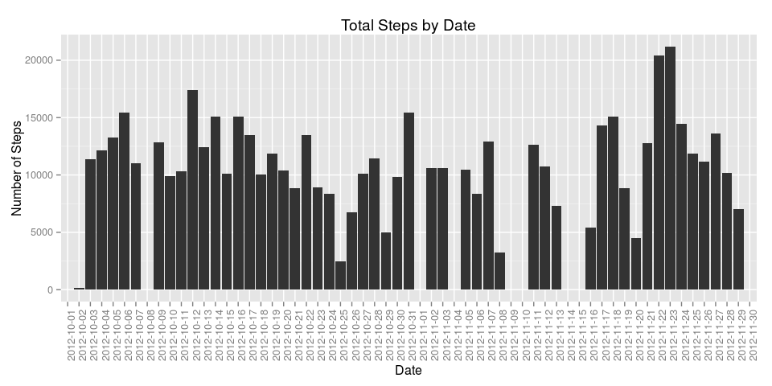
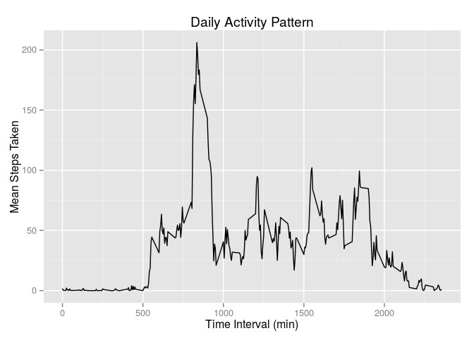

# Data Science, Reproducible Research, Peer Assessment 1
Matt Frichtl  
04/14/2015  


```r
library(ggplot2)
library(dplyr)
```

```
## 
## Attaching package: 'dplyr'
## 
## The following object is masked from 'package:stats':
## 
##     filter
## 
## The following objects are masked from 'package:base':
## 
##     intersect, setdiff, setequal, union
```

```r
data <- data.frame(read.csv("activity.csv", header = TRUE))
```

#1. Steps per Day

Calculate the total number of steps each day:


```r
daily_steps <- data %>%
    group_by(date) %>%
    summarise(steps = sum(steps))
```


```r
ggplot(data = daily_steps, aes(x = date, y = steps)) +
    geom_bar(stat = "identity") +
    labs(x = "Date", y = "Number of Steps", title = "Total Steps by Date") +
    theme(axis.text.x = element_text(angle = 90))
```



```r
mean_steps <- mean(daily_steps$steps, na.rm = TRUE)
sd_steps <- sd(daily_steps$steps, na.rm = TRUE)
summary(daily_steps)
```

```
##          date        steps      
##  2012-10-01: 1   Min.   :   41  
##  2012-10-02: 1   1st Qu.: 8841  
##  2012-10-03: 1   Median :10765  
##  2012-10-04: 1   Mean   :10766  
##  2012-10-05: 1   3rd Qu.:13294  
##  2012-10-06: 1   Max.   :21194  
##  (Other)   :55   NA's   :8
```

The mean number of steps taken daily is: 1.0766189\times 10^{4}  
The standard deviation of the number of steps taken daily is: 4269.1804927

#2. Average Daily Activity Pattern


```r
mean_interval <- data %>%
    group_by(interval) %>%
    summarise(steps = mean(steps, na.rm = TRUE))

ggplot(data = mean_interval, aes(x = interval, y = steps)) +
    geom_line() +
    labs(x = "Time Interval (min)", y = "Mean Steps Taken",
         title = "Daily Activity Pattern")
```



```r
max_steps = max(mean_interval$steps)
max_interval <- filter(mean_interval, steps == max_steps)
```

On average, the time interval in which the most steps are taken occurs at
835 minutes.

#3. Inputing Missing Values
The function below replaces any missing values in steps with the mean value for
that interval.


```r
check_and_replace <- function(entry, means = mean_interval) {
    if (is.na(entry$steps) == TRUE) {
        entry$steps = filter(mean_interval, interval == entry$interval)$steps
    }
    return(entry)
}
data_replaced <- data
for (row in seq_len(length(data[, 1]))) {
    data_replaced[row, ] <- check_and_replace(entry = data[row, ])
}
```

Now calculate daily steps with the new data set and plot a histogram with the
new daily sums.


```r
daily_steps_replaced <- data_replaced %>%
    group_by(date) %>%
    summarise(steps = sum(steps))

ggplot(data = daily_steps_replaced, aes(x = date, y = steps)) +
    geom_bar(stat = "identity") +
    labs(x = "Date", y = "Number of Steps", 
         title = "Total Steps by Date with Replacement Data") +
    theme(axis.text.x = element_text(angle = 90))
```


```r
mean_steps_replaced <- mean(daily_steps_replaced$steps)
median_steps_replaced <- median(daily_steps_replaced$steps)
```

The new data increases the number of steps taken each day because any missing
values were effectively 0 for the bar chart generated in part 1. The new mean
is 1.0766189\times 10^{4} and the new median is 1.0766189\times 10^{4}.

These values remain the same as in part 1. This because the replacement data 
used was simply the mean value for each interval, one would not expect the mean 
or median to have shifted from the previous calculation.

#4. Weekday vs Weekend Activity Patterns

```r
data_with_weekend <- data_replaced
data_with_weekend$weekend <- NA
for (row in seq_len(length(data_with_weekend[,1]))) {
    if(weekdays(as.POSIXct(data_with_weekend[row, ]$date)) == "Saturday") {
        data_with_weekend[row, ]$weekend <- "weekend"
    } else if(weekdays(as.POSIXct(data_with_weekend[row, ]$date)) == "Sunday") {
        data_with_weekend[row, ]$weekend <- "weekend"
    } else {
        data_with_weekend[row, ]$weekend <- "weekday"
    }
}
```


```r
ggplot(data = data_with_weekend, aes(x = interval, y = steps)) +
    geom_line() +
    facet_grid(weekend ~ .) +
    labs(y = "Number of Steps", x = "Interval",
         title = "Number of Steps Taken During on Weekdays versus Weekends")
```


